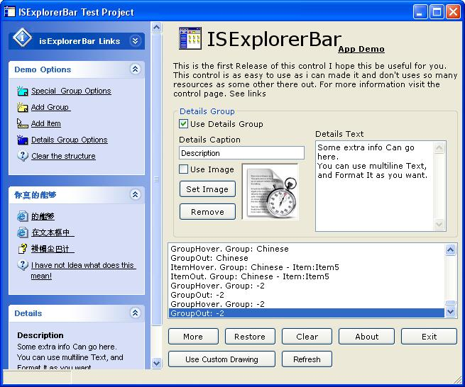



## isExplorerBar 1\.91  \- The Explorer Bar Control\. Updated: 2004\-08\-12

### Description

Just See the Screenshot!. Have You ever wanted

to use in your apps a control like the left bar

in the explorer? there are some controls like

that on the net, but they have too many

dependences. isExplorerBar is a SINGLE FILE

CONTROL and has almost NO DEPENDENCES (actually

runs without extra dependences in a new VB

Project) And uses THE REAL theme apareance or

emulates it when no theme data aviable,

everything is done in Runtime, using UxTheme.dll

(included in WinXP). no extra dll's or

subclasing cls modules, a single file control

that has everything you need to make your apps

look better. I've put a lot of work on this.

please donwnload and tellme what you think. I've

created a webpage for this control. includes

some help, comments and extra info about It.

please comments, sugestions and of course,

votes are wellcome.

----

Lot Of Updates, Current version: 1.91

Feedback comments, are wellcome. Visit the page for versions history.

Best Regards to everyone.

Fred.cpp
 
### More Info
 
a nice looking app

             |
---                |---
**Submitted On**   |2004-08-12 11:24:24
**By**             |[Fred\.cpp](https://github.com/Planet-Source-Code/PSCIndex/blob/master/ByAuthor/fred-cpp.md)
**Level**          |Advanced
**User Rating**    |4.9 (478 globes from 98 users)
**Compatibility**  |VB 5\.0, VB 6\.0
**Category**       |[Custom Controls/ Forms/  Menus](https://github.com/Planet-Source-Code/PSCIndex/blob/master/ByCategory/custom-controls-forms-menus__1-4.md)
**World**          |[Visual Basic](https://github.com/Planet-Source-Code/PSCIndex/blob/master/ByWorld/visual-basic.md)
**Archive File**   |[isExplorer1781108122004\.zip](https://github.com/Planet-Source-Code/fred-cpp-isexplorerbar-1-91-the-explorer-bar-control-updated-2004-08-12__1-53572/archive/master.zip)

### API Declarations

Tons, see the zip

